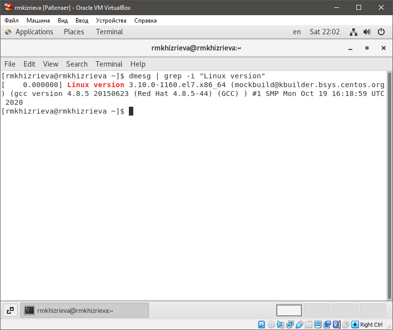
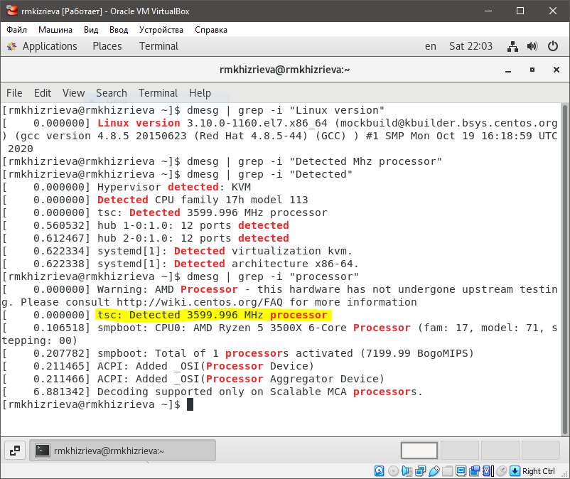
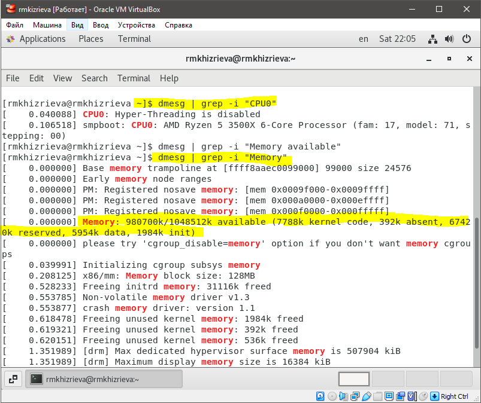
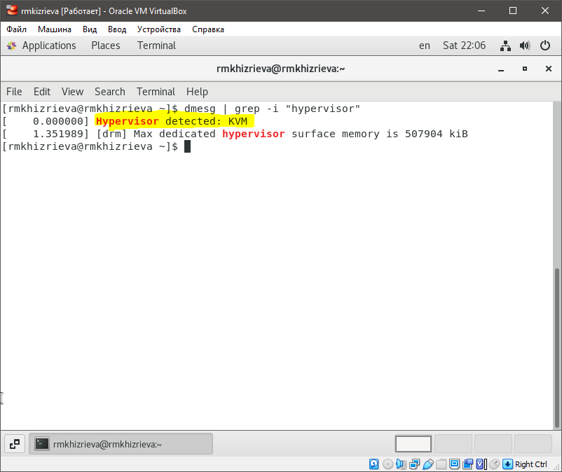
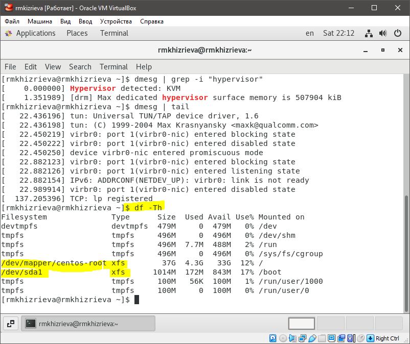
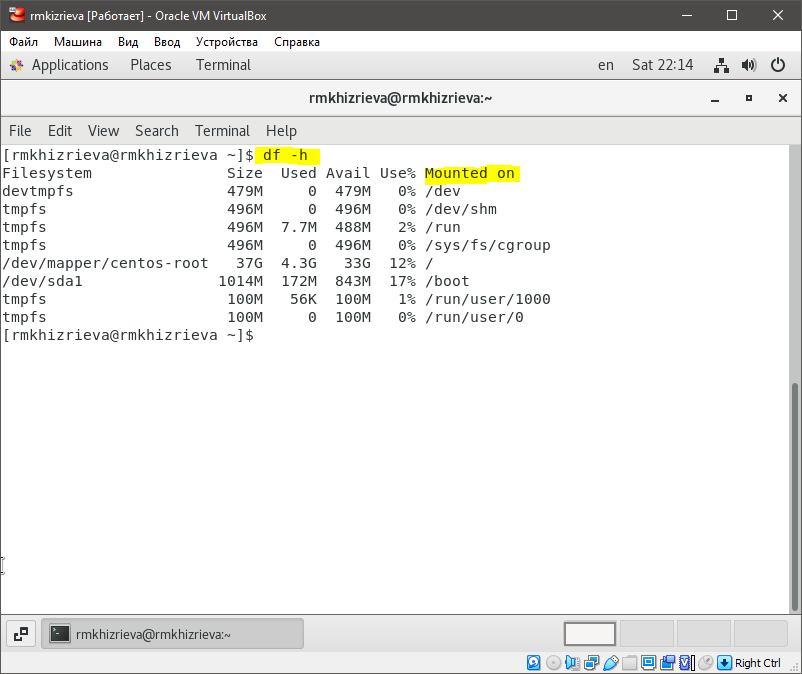

# **Отчет по лабораторной работе №1**
## **Информационная безопасность**
#### *Хизриева Рисалат НФИбд-02-19*

## **Содержание**
1. Цели работы
2. Задание
3. Выполнение лабораторной
4. Выводы и контрольные вопросы

### **Цели работы**
Целью данной работы является приобретение практических навыков
установки операционной системы на виртуальную машину, настройки минимально необходимых для дальнейшей работы сервисов.

### **Задание**
* Установить и настроить систему на виртуальную машину для дальнейшей работы с ней.
* Получите следующую информацию.
    1. Версия ядра Linux (Linux version).
    2. Частота процессора (Detected Mhz processor).
    3. Модель процессора (CPU0).
    4. Объем доступной оперативной памяти (Memory available).
    5. Тип обнаруженного гипервизора (Hypervisor detected).
    6. Тип файловой системы корневого раздела.
    7. Последовательность монтирования файловых систем.

### **Выполнение лабораторной работы**
#### *3.1 Установка системы*
    Следуя подробной инструкции, прилагаемой к заданию установить и настроить требуемую ОС. Процесс выполнения в видео, приложенному к отчету.
#### *3.2 Выполнение домашней работы*
**1.** *Версия ядра Linux (Linux version)*

**2.** *Частота процессора (Detected Mhz processor)*

**3.** *Модель процессора (CPU0) и объем доступной оперативной памяти (Memory available)*

**4.** *Тип обнаруженного гипервизора (Hypervisor detected)*

**5.** *Тип файловой системы корневого раздела*

**6.** *Последовательность монтирования файловых систем*

### **Выводы и контрольные вопросы**
В ходе выполнения лабораторной работы мы научились установливать и настраивать систему на виртуальную машину для дальнейшей работы с ней.

1. Какую информацию содержит учётная запись пользователя?
    Ответ:
2. Укажите команды терминала и приведите примеры:\
– для получения справки по команде; \
     Ответ: **man *название_команды*** \
– для перемещения по файловой системе; \
     Ответ: **cd/cd ..** (для перемещения на каталог вверх)\
– для просмотра содержимого каталога; \
     Ответ: **ls** \
– для определения объёма каталога; \
     Ответ: **df** \
– для создания / удаления каталогов / файлов; \
     Ответ: **создание/удаление файлов:** touch *название файла с расширением*/rm *название файла **создание/удаление каталогов:** mkdir *название каталога*/rmdir *название каталога* \
– для задания определённых прав на файл / каталог; \
     Ответ: **chmod** \
– для просмотра истории команд. \
     Ответ: **history** 
3. Что такое файловая система? Приведите примеры с краткой характеристикой. \
     Ответ: Фа́йловая систе́ма (англ. file system) — порядок, определяющий способ организации, хранения и именования данных на носителях информации в компьютерах, а также в другом электронном оборудовании.Файловая система определяет формат содержимого и способ физического хранения информации. 
4. Как посмотреть, какие файловые системы подмонтированы в ОС? \
     Ответ: Команда df сообщает об использовании дискового пространства файловой системой, чтобы включить тип файловой системы в конкретный раздел диска, используйте флаг -T: **df -Th**
5. Как удалить зависший процесс? 
     Ответ:  **kill [опция сигнала] PID**

