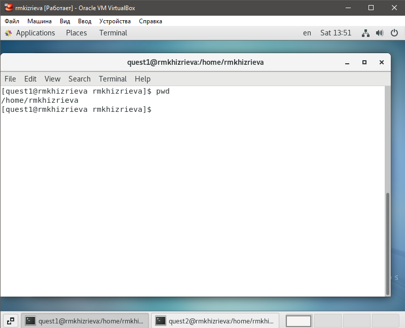
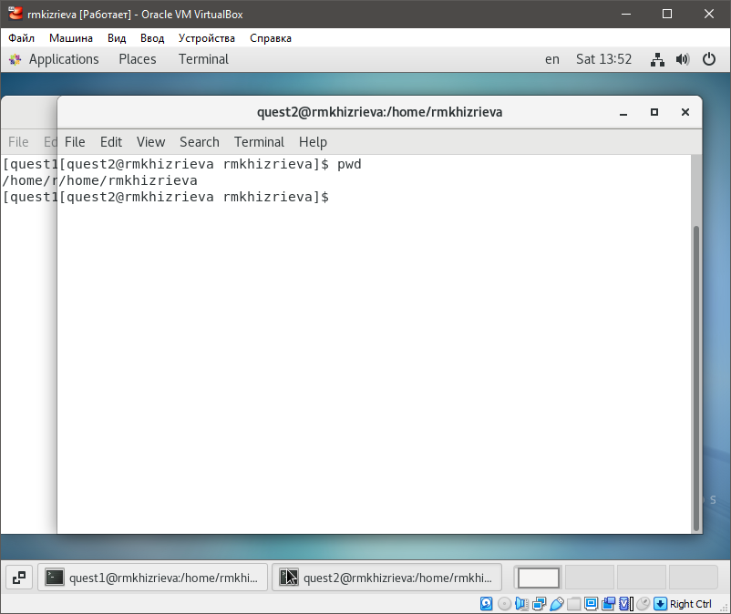
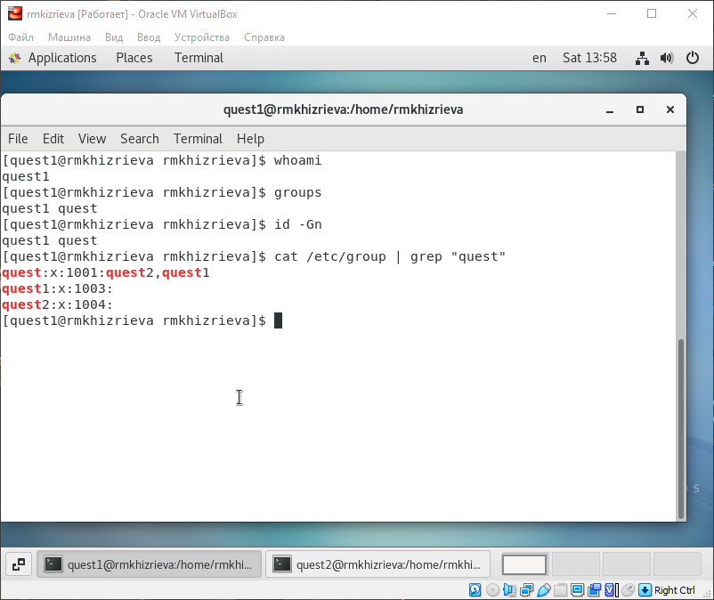
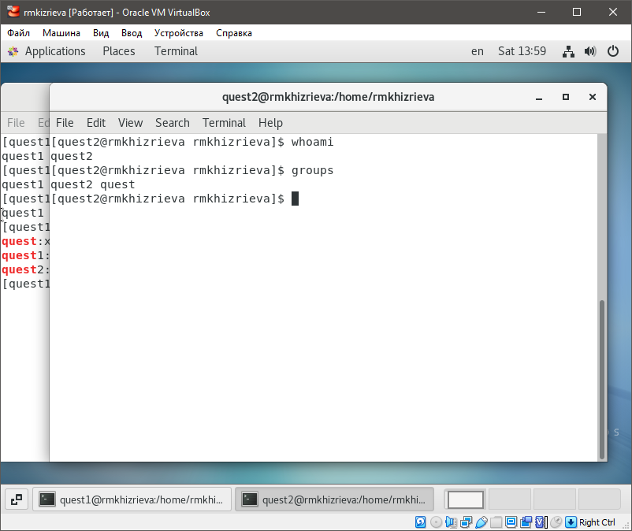
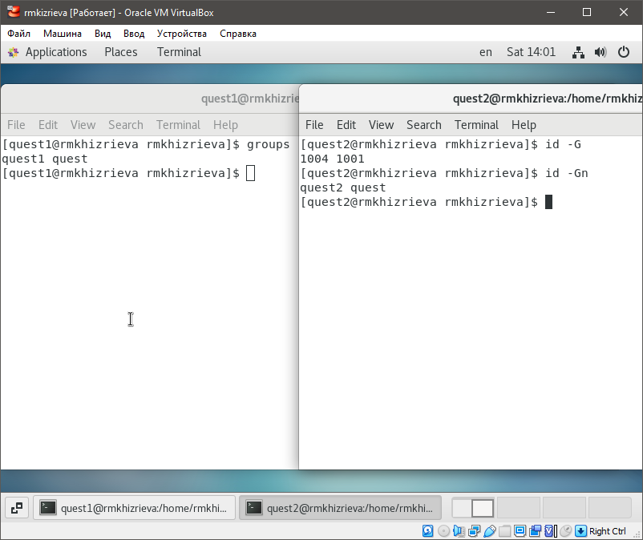
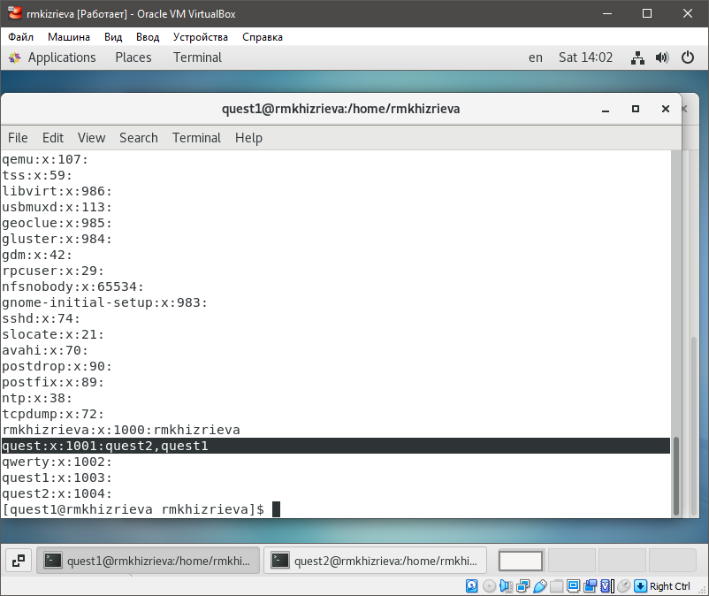
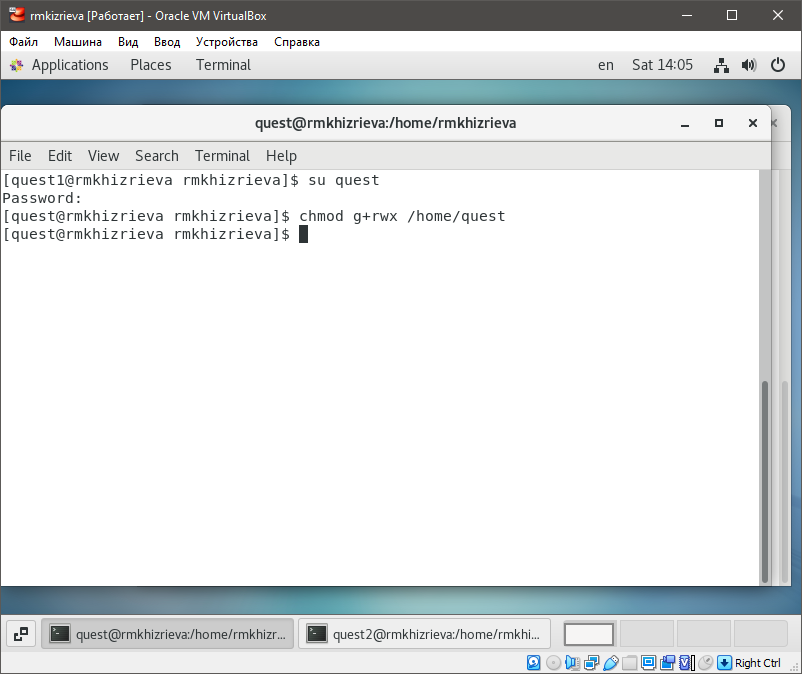
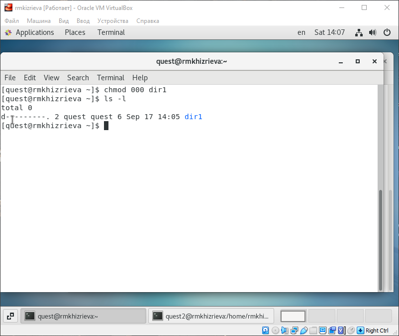

# **Отчет по лабораторной работе №2**
## **Информационная безопасность**
#### *Хизриева Рисалат НФИбд-02-19*


## **Содержание**
1. Цели работы
2. Задание
3. Выполнение лабораторной
4. Выводы и контрольные вопросы


### **Цели работы**
Цель лабораторной работы №3 - получение практических навыков работы в консоли с атрибутами файлов для групп пользователей.


### **Задание**
* Последовательно выполнить все пункты, занося ваши ответы на поставленные вопросы и замечания в отчёт.


### **Выполнение лабораторной работы**
#### *3.1 Выполнение пунктов*
1. В установленной операционной системе при выполнении предыдущей лабораторной работы была создана учётная запись пользователя guest (с использованием учётной записи администратора).

2. Аналогично учётной записи guest была создана учётная запись второго пользователя guest2, после чего пользователь guest2 был добавлен в группу guest с помощью команды gpasswd -a guest2 guest:

3. Был осуществлён вход в систему от двух пользователей на двух разных консолях: guest на первой консоли и guest2 на второй консоли.




4. Для обоих пользователей командой pwd были определены директории, в которых находится пользователь. Уточнили имя пользователя, его группу, кто входит в неё и к каким группам принадлежит он сам. Определили командами groups guest и groups guest2, в какие группы входят пользователи guest и guest2. Сравнили вывод команды groups с выводом команд id -Gn и id -G.





5. Сравнили полученную информацию с содержимым файла /etc/group. Просмотрели файл командой cat /etc/group.



6. От имени пользователя guest2 выполнили регистрацию пользователя guest2 в группе guest командой newgrp guest.


7. От имени пользователя guest изменили права директории /home/guest, разрешив все действия для пользователей группы: chmod g+rwx /home/guest.



8. От имени пользователя guest сняли с директории /home/guest/dir1 все атрибуты командой chmod 000 dirl и проверили правильность снятия атрибутов командой ls -l.



#### *3.2 Таблицы*
Заполним таблицу «Установленные права и разрешённые действия», выполняя действия от имени владельца директории (файлов), определим опытным путём, какие операции разрешены, а какие нет. Если операция разрешена, заносим в таблицу знак «+», если не разрешена, знак «-».

1 - Создание файла

2- Удаление файла

3- Запись в файл

4- Чтение файла

5- Смена директории

6- Просмотр файлов в директории

7 - Переименование файла

8- Смена атрибутов файла

*  Установленные права и разрешённые действия для групп

|Права директории|Права файла|1|2|3|4|5|6|7|8|
|:---|:---|---|---|---|---|---|---|---|---|
|```d---------(000)```|```----------(000)```|-|-|-|-|-|-|-|-|
|```d-----x---(010)```|```----------(000)```|-|-|-|-|+|-|-|+|
|```d----w----(020)```|```----------(000)```|-|-|-|-|-|-|-|-|
|```d----wx---(030)```|```----------(000)```|+|+|-|-|+|-|+|+|
|```d---r-----(040)```|```----------(000)```|-|-|-|-|-|+|-|-|
|```d---r-x---(050)```|```----------(000)```|-|-|-|-|+|+|-|+|
|```d---rw----(060)```|```----------(000)```|-|-|-|-|-|+|-|-|
|```d---rwx---(070)```|```----------(000)```|+|+|-|-|+|+|+|+|
|```d---------(000)```|```------x---(010)```|-|-|-|-|-|-|-|-|
|```d-----x---(010)```|```------x---(010)```|-|-|-|-|+|-|-|+|
|```d----w----(020)```|```------x---(010)```|-|-|-|-|-|-|-|-|
|```d----wx---(030)```|```------x---(010)```|+|+|-|-|+|-|+|+|
|```d---r-----(040)```|```------x---(010)```|-|-|-|-|-|+|-|-|
|```d---r-x---(050)```|```------x---(010)```|-|-|-|-|+|+|-|+|
|```d---rw----(060)```|```------x---(010)```|-|-|-|-|-|+|-|-|
|```d---rwx---(070)```|```------x---(010)```|+|+|-|-|+|+|+|+|
|```d---------(000)```|```-----w----(020)```|-|-|-|-|-|-|-|-|
|```d-----x---(010)```|```-----w----(020)```|-|-|+|-|+|-|-|+|
|```d----w----(020)```|```-----w----(020)```|-|-|-|-|-|-|-|-|
|```d----wx---(030)```|```-----w----(020)```|+|+|+|-|+|-|+|+|
|```d---r-----(040)```|```-----w----(020)```|-|-|-|-|-|+|-|-|
|```d---r-x---(050)```|```-----w----(020)```|-|-|+|-|+|+|-|+|
|```d---rw----(060)```|```-----w----(020)```|-|-|-|-|-|+|-|-|
|```d---rwx---(070)```|```-----w----(020)```|+|+|+|-|+|+|+|+|
|```d---------(000)```|```-----wx---(030)```|-|-|-|-|-|-|-|-|
|```d-----x---(010)```|```-----wx---(030)```|-|-|+|-|+|-|-|+|
|```d----w----(020)```|```-----wx---(030)```|-|-|-|-|-|-|-|-|
|```d----wx---(030)```|```-----wx---(030)```|+|+|+|-|+|-|+|+|
|```d---r-----(040)```|```-----wx---(030)```|-|-|-|-|-|+|-|-|
|```d---r-x---(050)```|```-----wx---(030)```|-|-|+|-|+|+|-|+|
|```d---rw----(060)```|```-----wx---(030)```|-|-|-|-|-|+|-|-|
|```d---rwx---(070)```|```-----wx---(030)```|+|+|+|-|+|+|+|+|
|```d---------(000)```|```----r-----(040)```|-|-|-|-|-|-|-|-|
|```d-----x---(010)```|```----r-----(040)```|-|-|-|+|+|-|-|+|
|```d----w----(020)```|```----r-----(040)```|-|-|-|-|-|-|-|-|
|```d----wx---(030)```|```----r-----(040)```|+|+|-|+|+|-|+|+|
|```d---r-----(040)```|```----r-----(040)```|-|-|-|-|-|+|-|-|
|```d---r-x---(050)```|```----r-----(040)```|-|-|-|+|+|+|-|+|
|```d---rw----(060)```|```----r-----(040)```|-|-|-|-|-|+|-|-|
|```d---rwx---(070)```|```----r-----(040)```|+|+|-|+|+|+|+|+|
|```d---------(000)```|```----r-x---(050)```|-|-|-|-|-|-|-|-|
|```d-----x---(010)```|```----r-x---(050)```|-|-|-|+|+|-|-|+|
|```d----w----(020)```|```----r-x---(050)```|-|-|-|-|-|-|-|-|
|```d----wx---(030)```|```----r-x---(050)```|+|+|-|+|+|-|+|+|
|```d---r-----(040)```|```----r-x---(050)```|-|-|-|-|-|+|-|-|
|```d---r-x---(050)```|```----r-x---(050)```|-|-|-|+|+|+|-|+|
|```d---rw----(060)```|```----r-x---(050)```|-|-|-|-|-|+|-|-|
|```d---rwx---(070)```|```----r-x---(050)```|+|+|-|+|+|+|+|+|
|```d---------(000)```|```----rw----(060)```|-|-|-|-|-|-|-|-|
|```d-----x---(010)```|```----rw----(060)```|-|-|+|+|+|-|-|+|
|```d----w----(020)```|```----rw----(060)```|-|-|-|-|-|-|-|-|
|```d----wx---(030)```|```----rw----(060)```|+|+|+|+|+|-|+|+|
|```d---r-----(040)```|```----rw----(060)```|-|-|-|-|-|+|-|-|
|```d---r-x---(050)```|```----rw----(060)```|-|-|+|+|+|+|-|+|
|```d---rw----(060)```|```----rw----(060)```|-|-|-|-|-|+|-|-|
|```d---rwx---(070)```|```----rw----(060)```|+|+|+|+|+|+|+|+|
|```d---------(000)```|```----rwx---(070)```|-|-|-|-|-|-|-|-|
|```d-----x---(010)```|```----rwx---(070)```|-|-|+|+|+|-|-|+|
|```d----w----(020)```|```----rwx---(070)```|-|-|-|-|-|-|-|-|
|```d----wx---(030)```|```----rwx---(070)```|+|+|+|+|+|-|+|+|
|```d---r-----(040)```|```----rwx---(070)```|-|-|-|-|-|+|-|-|
|```d---r-x---(050)```|```----rwx---(070)```|-|-|+|+|+|+|-|+|
|```d---rw----(060)```|```----rwx---(070)```|-|-|-|-|-|+|-|-|
|```d---rwx---(070)```|```----rwx---(070)```|+|+|+|+|+|+|+|+|

При сравнении табл. 2.1 (из лабораторной работы № 2) и табл. 3.1. была выявлена разница лишь в том, что в предыдущей лабораторной работе права присваивались пользователю, а в этой - группе.

На основании таблицы выше определили минимально необходимые права для выполнения пользователем guest2 операций внутри директории dir1 и заполнили таблицу ниже
* Минимальные права для совершения операций от имени пользователей входящих в группу 

|Операция|Минимальные права на директорию|Минимальные права на файл|
|:---:|:---:|:---:|
|Создание файла|```d----wx---(030)```|```----------(000)```|	    
|Удаление файла|```d----wx---(030)```|```----------(000)```|
|Чтение файла|```d-----x---(010)```|```----r-----(040)```|
|Запись в файл|```d-----x---(010)```|```-----w----(020)```|
|Переименование файла|```d----wx---(030)```|```----------(000)```|
|Создание поддиректории|```d----wx---(030)```|```----------(000)```|
|Удаление поддиректории|```d----wx---(030)```|```----------(000)```|

### **Выводы**
В ходе выполнения лабораторной работы были получены практические навыки работы в консоли с атрибутами файлов для групп пользователей.


