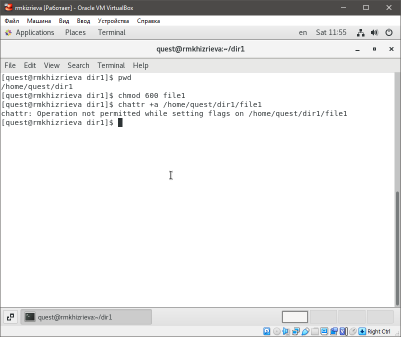
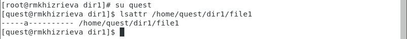
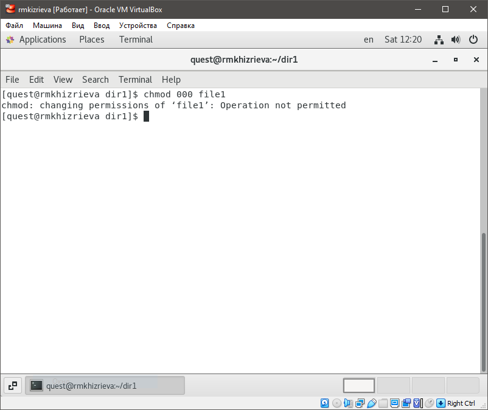
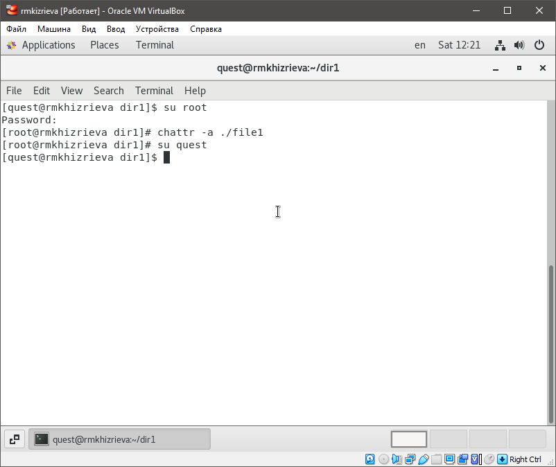
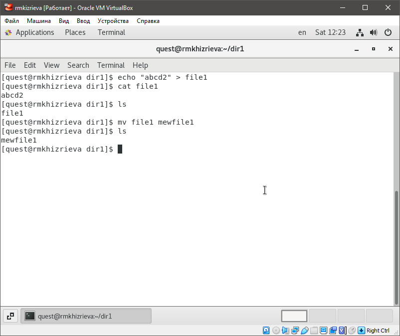

# **Отчет по лабораторной работе №4**
## **Информационная безопасность**
#### *Хизриева Рисалат НФИбд-02-19*

---

## **Содержание**
1. Цели работы
2. Выполнение лабораторной
3. Вывод

---

### **Цели работы**
Цель лабораторной работы №4 - получение практических навыков работы в консоли с расширенными атрибутами файлов.

---

### **Выполнение лабораторной работы**

1.	Расширенные атрибуты файла /home/guest/dir1/file1

---

2.	Установка прав и расширенных атрибутов на файл file1

---

3.	Установка расширенных атрибутов на файл file1 от имени суперпользователя

---

4.	Расширенные атрибуты файла file1

---

5.	Дозапись в файл file1 слова «test»

---

6.	Удаление и переименование файла file1

---

7.	Установка на файл прав, запрещающих чтение/запись для владельца файла

---

8.	Снятие расширенного атрибута 

---

После повторила операции, которые ранее не удалось выполнить. 

---

### **Выводы**
В ходе выполнения лабораторной работы были получены практические навыки работы в консоли с расширенными атрибутами файлов.

---
