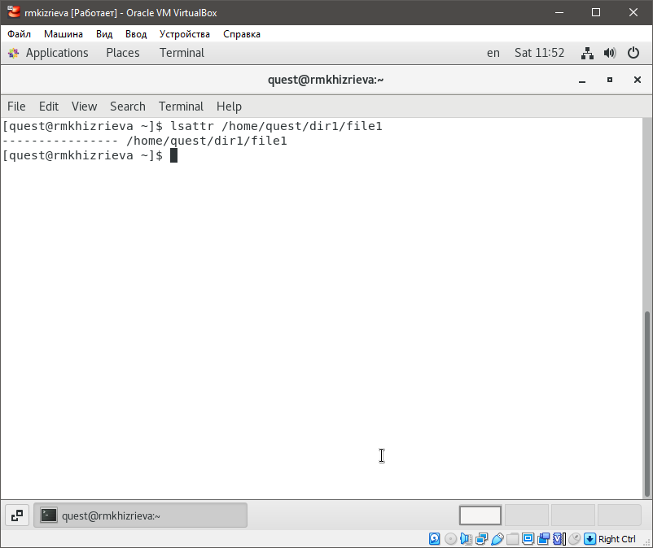
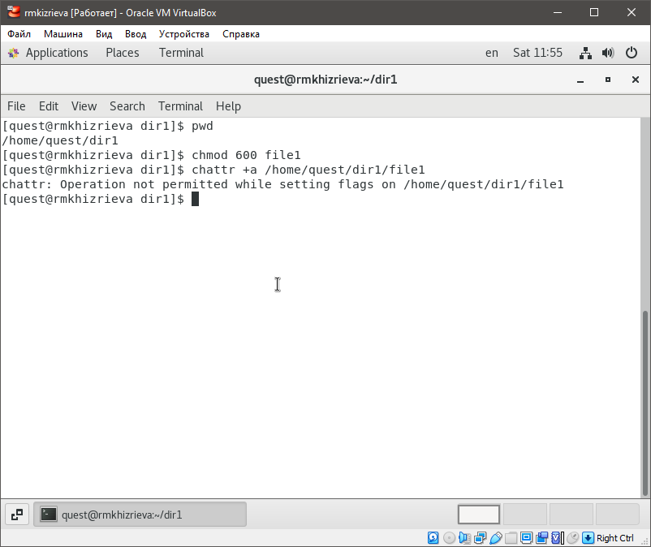
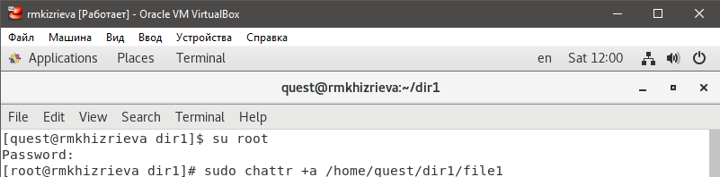
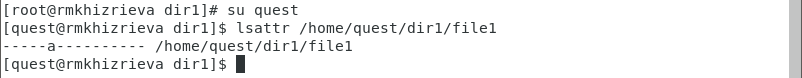
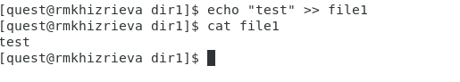
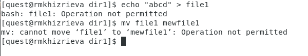
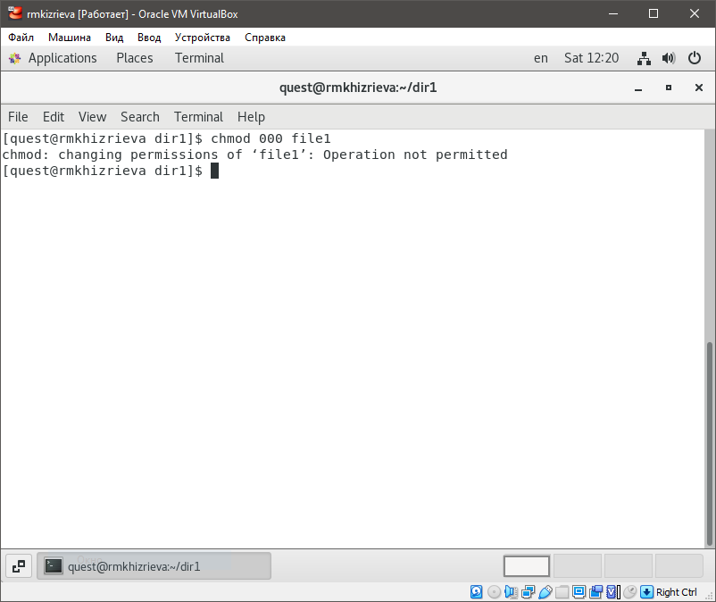
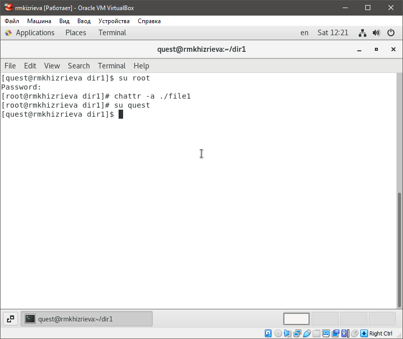
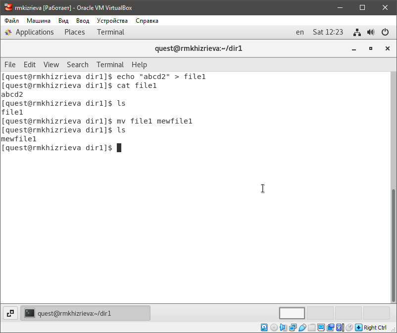

# **Отчет по лабораторной работе №2**
## **Информационная безопасность**
#### *Хизриева Рисалат НФИбд-02-19*

## **Содержание**
1. Цели работы
2. Выполнение лабораторной
3. Вывод

### **Цели работы**
Цель лабораторной работы №4 - получение практических навыков работы в консоли с расширенными атрибутами файлов.

### **Выполнение лабораторной работы**
#### *3.1 Выполнение пунктов*
1.	От имени пользователя guest определила расширенные атрибуты файла /home/guest/dir1/file1 командой lsattr /home/guest/dir1/file1.

2.	Установила командой chmod 600 file1 на файл file1 права, разрешающие чтение и запись для владельца файла. Попробовала установить на файл /home/guest/dir1/file1 расширенный атрибут a от имени пользователя guest с помощью команды chattr +a /home/guest/dir1/file1. В ответ был получен отказ от выполнения операции.

3.	Зашла в другом окне консоли с правами администратора и попровала установить расширенный атрибут a на файл /home/guest/dir1/file1 от имени суперпользователя с помощью команды chattr +a /home/guest/dir1/file1.

4.	От пользователя guest проверила правильность установления атрибута с помощью команды lsattr /home/guest/dir1/file1.

5.	Выполнила дозапись в файл file1 слова «test» командой echo >> “test” /home/guest/dir1/file1. После этого выполнила чтение файла file1 командой cat /home/guest/dir1/file1. Убедилась, что слово test было успешно записано в file1.

6.	Попробовала удалить и переименовать файл file1. В обоих случаях был получен отказ от выполнения операции.

7.	Попробовала с помощью команды chmod 000 file1 установить на файл file1 права, запрещающие чтение и запись для владельца файла. При выполнении команды был получен отказ от выполнения операции.

8.	Сняла расширенный атрибут a с файла /home/guest/dirl/file1 от имени суперпользователя командой chattr -a /home/guest/dir1/file1.

После повторила операции, которые ранее не удалось выполнить. Все операции были выполнены успешно.

### **Выводы**
В ходе выполнения лабораторной работы были получены практические навыки работы в консоли с расширенными атрибутами файлов.

