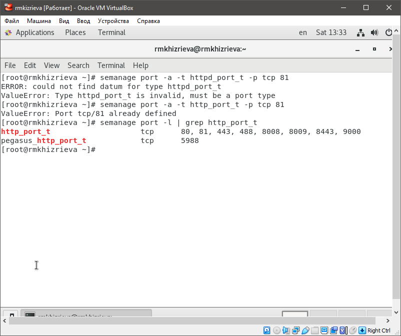

# Цели и задачи работы

## Цель лабораторной работы

Развитие навыков администрирования ОС Linux, первое практическое знакомство с технологией SELinux, а также проверка работы SELinx на практике совместно с веб-сервером Apache.

---

## Процесс выполнения лабораторной работы

### Проверка работы SELinux и веб-сервера

---

### Веб-сервер Apache

---
### Состояние переключателей SELinux

---
### Команда seinfo

---

### Тип файлов и поддиректорий

---

### Создание html-файла /var/www/html/test.html

---

### Обращение к файлу test.html

---

### Контекст файла test.html

---

### log-файлы веб-сервера Apache и системный log-файл

---

### Запуск веб-сервера Apache на прослушивание ТСР-порта 81

---

### Вывод списка портов

---

### Возвращение контекста

---
# Выводы по проделанной работе

## Вывод

В результате проделанной лабораторной работы были развиты навыки администрирования ОС Linux, получено первое практическое знакомство с технологией SELinux, а также была проверена работа SELinux на практике совместно с веб-сервером Apache.
