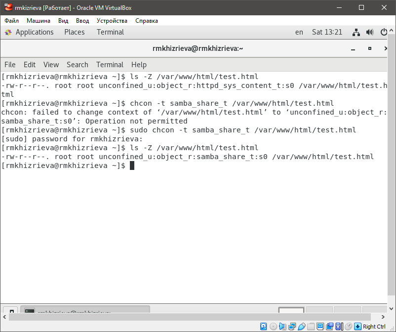
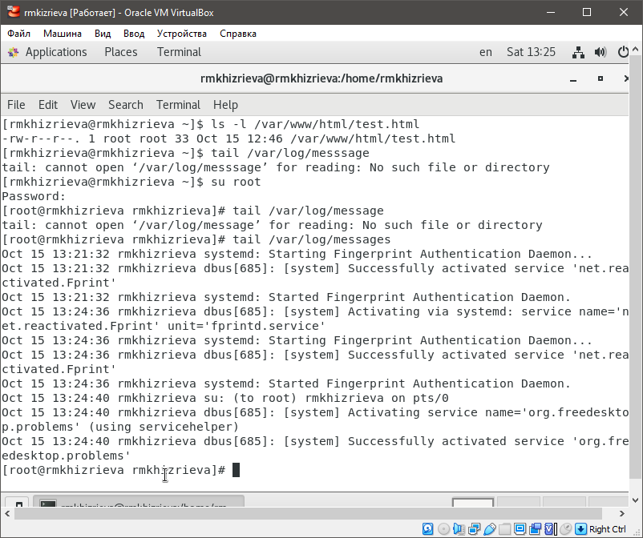
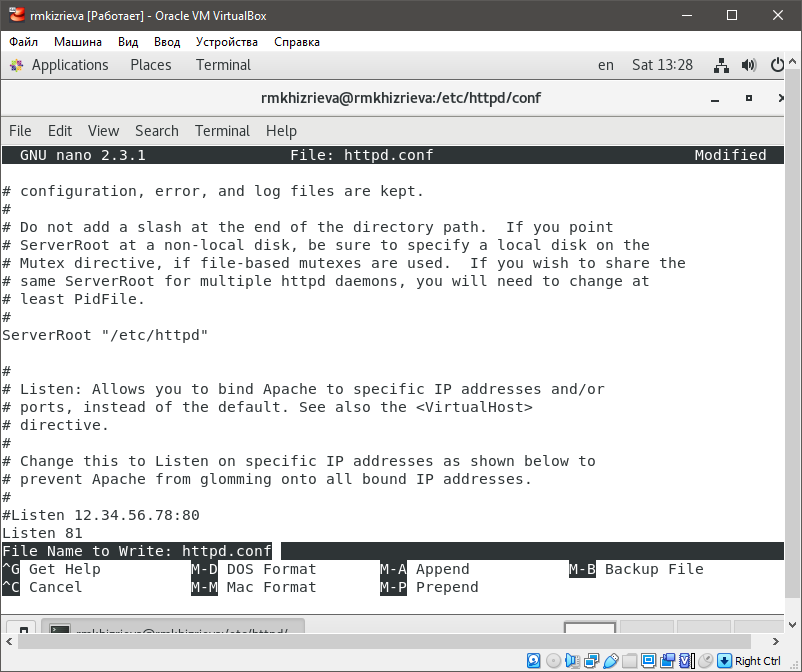

# **Отчет по лабораторной работе №6**
## **Информационная безопасность**
#### *Хизриева Рисалат НФИбд-02-19*

## **Содержание**
1. Цели работы
2. Выполнение лабораторной
3. Вывод

### **Цели работы**
Развить навыки администрирования ОС Linux. Получить первое практическое знакомство с технологией SELinux. Проверить работу SELinx на практике совместно с веб-сервером Apache.

### **Выполнение лабораторной работы**
#### *3.1 Выполнение пунктов*
1. Войдите в систему с полученными учётными данными и убедитесь, что
SELinux работает в режиме enforcing политики targeted с помощью команд getenforce и sestatus.

2. Обратитесь с помощью браузера к веб-серверу, запущенному на вашем
компьютере, и убедитесь, что последний работает:
`service httpd status`
или
`/etc/rc.d/init.d/httpd status`
Если не работает, запустите его так же, но с параметром start.

3. Найдите веб-сервер Apache в списке процессов, определите его контекст
безопасности и занесите эту информацию в отчёт. Например, можно использовать команду
`ps auxZ | grep httpd`
или
`ps -eZ | grep httpd`

4. Посмотрите текущее состояние переключателей SELinux для Apache с
помощью команды
`sestatus -bigrep httpd`

5. Посмотрите статистику по политике с помощью команды seinfo, также
определите множество пользователей, ролей, типов.

6. и 7. Определите тип файлов и поддиректорий, находящихся в директории
/var/www, с помощью команды
`ls -lZ /var/www`
Определите тип файлов, находящихся в директории /var/www/html:
`ls -lZ /var/www/html`

8. Определите круг пользователей, которым разрешено создание файлов в
директории /var/www/html.

9. Создайте от имени суперпользователя (так как в дистрибутиве после установки только ему разрешена запись в директорию) html-файл
/var/www/html/test.html следующего содержания:
<html>
<body>test</body>
</html>

10. Проверьте контекст созданного вами файла. Занесите в отчёт контекст,
присваиваемый по умолчанию вновь созданным файлам в директории
/var/www/html.

11. Обратитесь к файлу через веб-сервер, введя в браузере адрес
http://127.0.0.1/test.html. Убедитесь, что файл был успешно отображён.

12. и 13. Изучите справку man httpd_selinux и выясните, какие контексты файлов определены для httpd. Сопоставьте их с типом файла
test.html. Проверить контекст файла можно командой ls -Z.
`ls -Z /var/www/html/test.html`
Измените контекст файла /var/www/html/test.html с
httpd_sys_content_t на любой другой, к которому процесс httpd не
должен иметь доступа, например, на samba_share_t:
`chcon -t samba_share_t /var/www/html/test.html`
`ls -Z /var/www/html/test.html`
После этого проверьте, что контекст поменялся.

14. Попробуйте ещё раз получить доступ к файлу через веб-сервер, введя в
браузере адрес http://127.0.0.1/test.html. Вы должны получить
сообщение об ошибке:
Forbidden
You don't have permission to access /test.html on this server.

15. Проанализируйте ситуацию. Почему файл не был отображён, если права
доступа позволяют читать этот файл любому пользователю?
`ls -l /var/www/html/test.html`
Просмотрите log-файлы веб-сервера Apache. Также просмотрите системный лог-файл:
`tail /var/log/messages`
Если в системе окажутся запущенными процессы setroubleshootd и
audtd, то вы также сможете увидеть ошибки, аналогичные указанным
выше, в файле /var/log/audit/audit.log. Проверьте это утверждение самостоятельно.

16. Попробуйте запустить веб-сервер Apache на прослушивание ТСР-порта
81 (а не 80, как рекомендует IANA и прописано в /etc/services). Для
этого в файле /etc/httpd/httpd.conf найдите строчку Listen 80 и
замените её на Listen 81.

17. Выполните перезапуск веб-сервера Apache. Произошёл сбой.

18. Проанализируйте лог-файлы:
`tail -nl /var/log/messages`
Просмотрите файлы /var/log/http/error_log,
/var/log/http/access_log и /var/log/audit/audit.log и
выясните, в каких файлах появились записи.

19. Выполните команду
`semanage port -a -t http_port_t -р tcp 81`
После этого проверьте список портов командой
`semanage port -l | grep http_port_t`
Убедитесь, что порт 81 появился в списке.

20. Попробуйте запустить веб-сервер Apache ещё раз. Поняли ли вы, почему
он сейчас запустился, а в предыдущем случае не смог?

21. Верните контекст httpd_sys_cоntent__t к файлу /var/www/html/ test.html:
`chcon -t httpd_sys_content_t /var/www/html/test.html`
После этого попробуйте получить доступ к файлу через веб-сервер, введя в браузере адрес http://127.0.0.1:81/test.html.
Вы должны увидеть содержимое файла — слово «test».

22. Исправьте обратно конфигурационный файл apache, вернув Listen 80.

23. Удалите привязку http_port_t к 81 порту:
`semanage port -d -t http_port_t -p tcp 81`
и проверьте, что порт 81 удалён.

24. Удалите файл /var/www/html/test.html:
`rm /var/www/html/test.html`

### **Выводы**
В ходе выполнения лабораторной работы были развиты навыки администрирования ОС Linux, получено первое практическое знакомство с технологией SELinux, а также была проверена работа SELinux на практике совместно с веб-сервером Apache.

