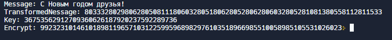

# **Отчет по лабораторной работе №7**
## **Информационная безопасность**
#### *Хизриева Рисалат НФИбд-02-19*

---

## **Содержание**
1. Цели работы
2. Выполнение лабораторной
3. Контрольные вопросы
4. Вывод

---

### **Цели работы**
Освоить на практике применение режима однократного гаммирования.

---

### **Выполнение лабораторной работы**
#### *Написание программы*
### 1. Написала следующую программу на C++, шифрующую введенное сообщение при помощи случайно сгенерированного ключа:

---

```
#include <iostream>
#include <string>
#include <vector>

using namespace std;

string transform(string toEncrypt) { // функция для трансформирования сообщения
  string transformedMessage;
  for (int i = 0; i < toEncrypt.size(); ++i) {
    int ia = toascii(toEncrypt.at(i));
    transformedMessage.push_back(ia);
  }
  return transformedMessage;
}

string keygeneration(string toEncrypt) { // генерация ключа
  string key;
  static const char code[] = "0123456789";

  for (int i = 0; i < toEncrypt.size(); ++i) {
    key += code[rand() % (sizeof(code) - 1)];
  }
  return key;
}

string encryptdecrypt(string toEncrypt,
                      string key) { // шифруем сообщение с помощью ключа
  string output = toEncrypt;
  for (int i = 0; i < toEncrypt.size(); ++i) {
    output[i] = toEncrypt[i] ^ key[i];
  }
  return output;
}

int main(int argc, const char *argv[]) {
  setlocale(LC_ALL, "Russian");

  string message = "С Новым годом друзья!";
  string transformedMessage = transform(message);
  string key = keygeneration(transformedMessage);
  string encrypted = encryptdecrypt(transformedMessage, key);

  cout << "Message: " << message << "\n";
  cout << "TransformedNessage: " ;
  for (int i = 0; i < transformedMessage.size(); ++i) {
    cout << int(transformedMessage[i]);
  }
  cout << "\n"<< "Key: " << key << "\n";
  cout << "Encrypt: ";
  for (int i = 0; i < encrypted.size(); ++i) {
    cout << int(encrypted[i]);
  }

  return 0;
}

```
---

### 2. Результат работы:


---

### **Контрольные вопросы**
1. Поясните смысл однократного гаммирования. \
    **Ответ:** Это метод симметричного шифрования, заключающийся в «наложении» последовательности, состоящей из случайных чисел, на открытый текст.

2. Перечислите недостатки однократного гаммирования. \
    **Ответ:** - необходимость иметь огромные объемы данных, -организация конфиденциального канала передачи данных

---

3. Перечислите преимущества однократного гаммирования. \
    **Ответ:** является невскрываемым, шифр является абсолютно стойким
4. Почему длина открытого текста должна совпадать с длиной ключа? \
    **Ответ:** для правильности расшифровки


5. Какая операция используется в режиме однократного гаммирования, назовите её особенности? \
    **Ответ:** операция сложения по модулю 2 (XOR) между элементами гаммы и элементами подлежащего сокрытию текста.  как работает операция XOR над битами: 0 XOR 0 = 0; 0 XOR 1 = 1; 1 XOR 0 = 1; 1 XOR 1 = 0.

---    
6. Как по открытому тексту и ключу получить шифротекст? \
    **Ответ:**  **Ci = Pi XOR Ki**; \
    где  Ci - i-й символ получившегося зашифрованного послания, Ki - i-й символ ключа, Pi - i-й символ открытого текста.
    
7. Как по открытому тексту и шифротексту получить ключ? \
    **Ответ:** Если известны шифротекст и открытый текст, то обе части равенства необходимо сложить по модулю 2 с Pi :\
    **Ci XOR Pi = Pi XOR Ki XOR Pi = Ki**,  
    **Ki = Ci XOR Pi**
---

8. В чем заключаются необходимые и достаточные условия абсолютной 
стойкости шифра? \
    **Ответ:** Необходимые и достаточные условия абсолютной стойкости шифра:

·  полная случайность ключа;

·  равенство длин ключа и открытого текста;

·  однократное использование ключа.

---

### **Выводы**
В ходе выполнения лабораторной работы было освоено на практике применение режима однократного гаммирования.
